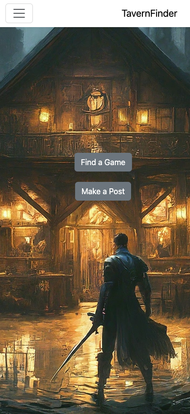
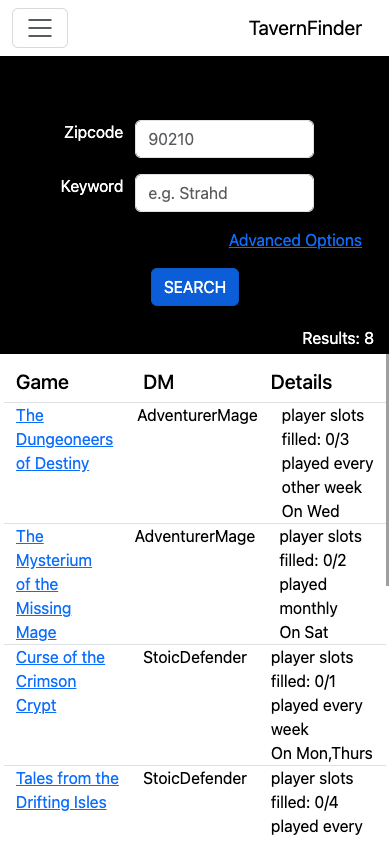
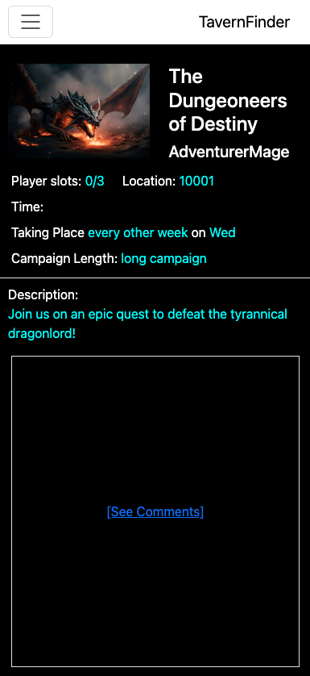
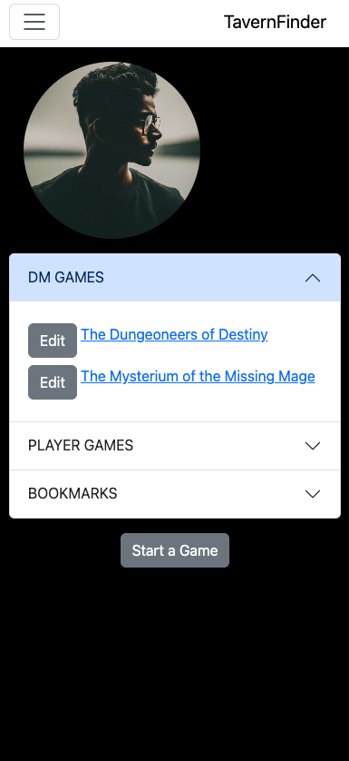
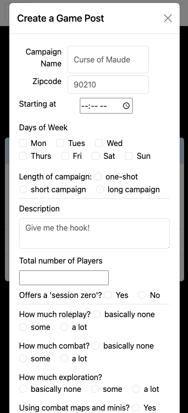

- **Title**: Tavern Finder
- **Description**: 
    Dungeons and Dragons is a game that is played worldwide. New players in the community often ask "where do I go to find a group?"  Just as the classic tavern is often the start point and meeting place for player characters in an actual game of DND, Tavern Finder serves a similar purpose.  Here, a player will be able to search for locally hosted games using meaningful criteria that will best match them to a game and Dungeon Master most suited to their play style and interests.

    Users interested in running a game can make a post with details on their existing or potential game.  Players are then able to comment on this post to find out more or request to join.

- **Technologies Used**: HTML, Javascript, CSS, Bootstrap, NodeJS, Express, with a Mongoose / MongoDB database.

- **Getting Started**: 
Front-end deployed on vercel: https://tavern-finder-frontend.vercel.app/
Back-end deployed on heroku: https://tavern-finder-api-03e4c798f637.herokuapp.com/
trello board: https://trello.com/b/vY6c4zyw/tavern-finder
lucidchartERD: 

- **Attributions**: 
 - Bootstrap was used heavily to render several pre-styled components such as a navbar, modal, and accordion
 https://getbootstrap.com/

- **Screenshots**:

-**Next Steps**: Further implementation on the frontend of the established server CRUD methods will be necessary to grant full user experience--including posting comments and editing/deleting posts.  Implementing a notification functionality would be the next logical step that would allow users to know if one of their posts has received comments or if one of their comments has been commented on.